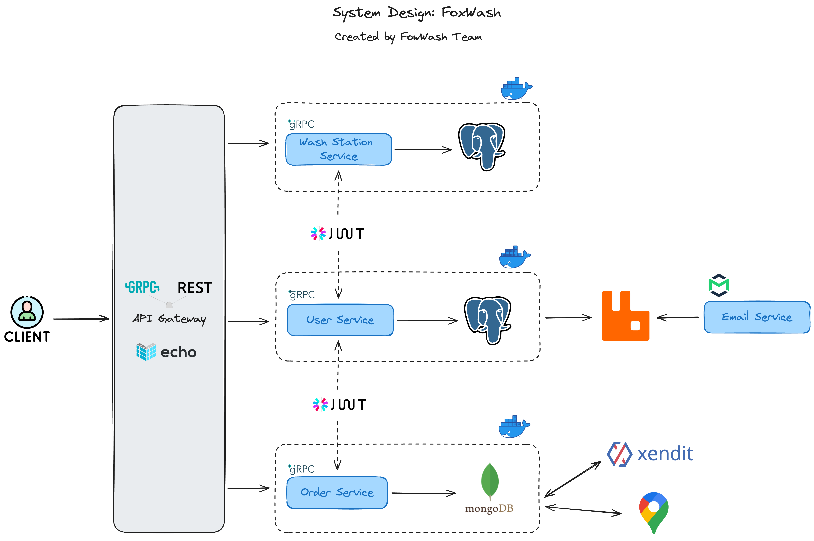
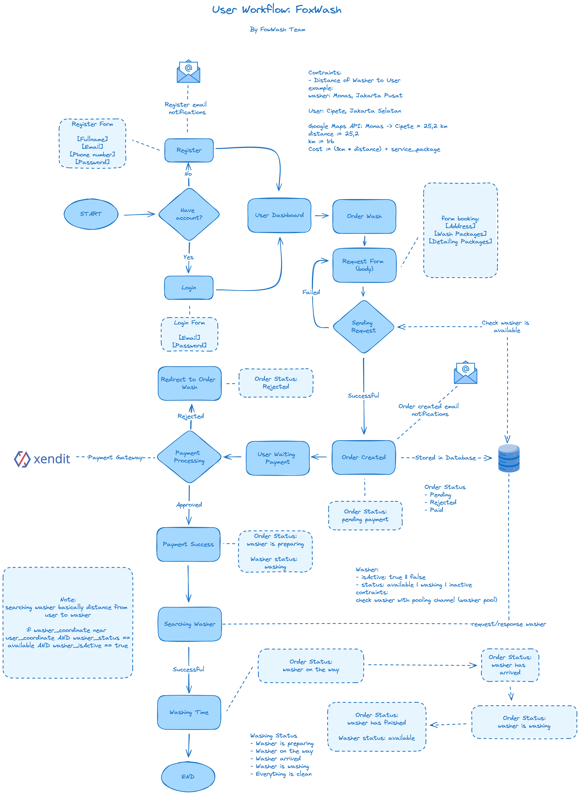
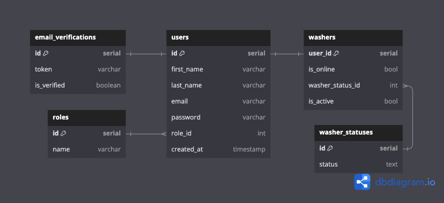
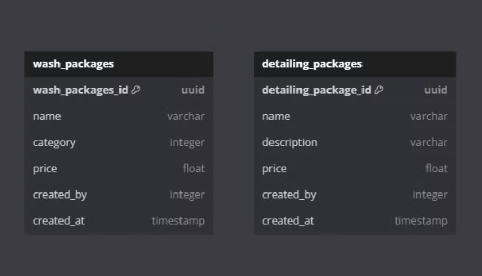
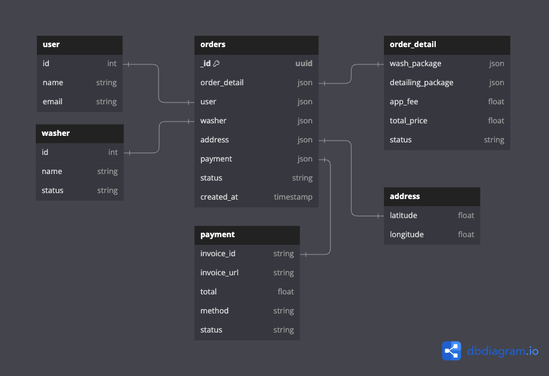

## Description
Fox Wash an online motorcycle washing service powered by microservices that seamlessly integrates users, washerman, and administrators.
> Within 2 weeks, we were able to complete 27 endpoints and 30 gRPC services.

## Highlights
* Microservices Architecture
* Email Notifications
* Google Maps Integration
* Payment Gateway (Xendit)

## Tech Stacks
* Go
* Echo
* gRPC
* PostgreSQL
* MongoDB
* Docker
* JWT-Authorization
* 3rd Party APIs (Mailtrap, Xendit, Google Maps)
* RabbitMQ
* REST
* Swagger
* Testify

## System Design

## User Workflow

### User Service (PostgreSQL)

### Wash Station Service (PostgreSQL)

### Order Service (MongoDB)

